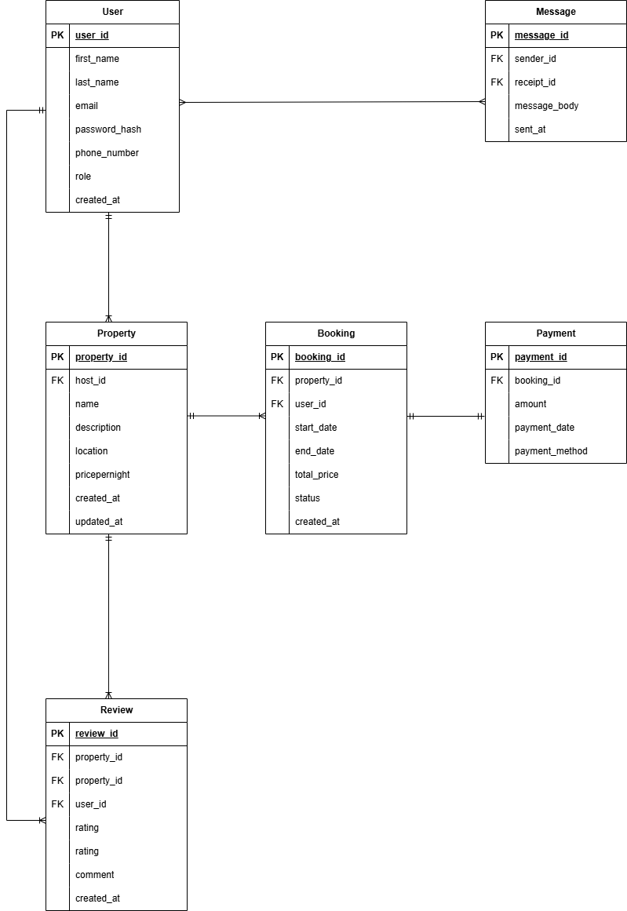

# Database Specification - AirBnB

## 📊 Database Overview
This project implements a fully normalized database schema with proper relationships, constraints, and indexing to support a robust vacation rental platform.

## 🗃️ Core Entities
+ Users - Handles hosts, guests, and administrators with role-based access
+ Properties - Manages rental listings with detailed descriptions and pricing
+ Bookings - Processes reservations with date ranges and status tracking
+ Payments - Secures transaction records for completed bookings
+ Reviews - Captures guest feedback and property ratings
+ Messages - Facilitates communication between users

## Entities and Attributes

## User
+ user_id: Primary Key, UUID, Indexed
+ first_name: VARCHAR, NOT NULL
+ last_name: VARCHAR, NOT NULL
+ email: VARCHAR, UNIQUE, NOT NULL
+ password_hash: VARCHAR, NOT NULL
+ phone_number: VARCHAR, NULL
+ role: ENUM (guest, host, admin), NOT NULL
+ created_at: TIMESTAMP, DEFAULT + CURRENT_TIMESTAMP

## Property
+ property_id: Primary Key, UUID, Indexed
+ host_id: Foreign Key, references User(user_id)
+ name: VARCHAR, NOT NULL
+ description: TEXT, NOT NULL
+ location: VARCHAR, NOT NULL
+ pricepernight: DECIMAL, NOT NULL
+ created_at: TIMESTAMP, DEFAULT CURRENT_TIMESTAMP
+ updated_at: TIMESTAMP, ON UPDATE CURRENT_TIMESTAMP

## Booking
+ booking_id: Primary Key, UUID, Indexed
+ property_id: Foreign Key, references Property(property_id)
+ user_id: Foreign Key, references User(user_id)
+ start_date: DATE, NOT NULL
+ end_date: DATE, NOT NULL
+ total_price: DECIMAL, NOT NULL
+ status: ENUM (pending, confirmed, canceled), NOT NULL
+ created_at: TIMESTAMP, DEFAULT CURRENT_TIMESTAMP

## Payment
+ payment_id: Primary Key, UUID, Indexed
+ booking_id: Foreign Key, references + + + Booking(booking_id)
+ amount: DECIMAL, NOT NULL
+ payment_date: TIMESTAMP, DEFAULT CURRENT_TIMESTAMP
+ payment_method: ENUM (credit_card, paypal, stripe), NOT NULL

## Review
+ review_id: Primary Key, UUID, Indexed
+ property_id: Foreign Key, references Property(property_id)
+ user_id: Foreign Key, references User(user_id)
+ rating: INTEGER, CHECK: rating >= 1 AND rating <= 5, NOT NULL
+ comment: TEXT, NOT NULL
+ created_at: TIMESTAMP, DEFAULT CURRENT_TIMESTAMP

## Message
+ message_id: Primary Key, UUID, Indexed
+ sender_id: Foreign Key, references User(user_id)
+ recipient_id: Foreign Key, references User(user_id)
+ message_body: TEXT, NOT NULL
+ sent_at: TIMESTAMP, DEFAULT CURRENT_TIMESTAMP

# Relationships between entities

1. User ↔ Property
+ Relationship: One-to-Many (1:N)
+ Explanation: One user (as host) can own many properties, but each property belongs to only one host
+ In your schema: Property.host_id references User.user_id

2. User ↔ Booking
+ Relationship: One-to-Many (1:N)
+ Explanation: One user can make many bookings, but each   booking is made by only one user
+ In your schema: Booking.user_id references User.user_id

3. Property ↔ Booking
+ Relationship: One-to-Many (1:N)
+ Explanation: One property can have many bookings, but each booking is for only one property
+ In your schema: Booking.property_id references Property.property_id

4. Booking ↔ Payment
+ Relationship: One-to-One (1:1)
+ Explanation: One booking has exactly one payment, and one payment belongs to exactly one booking
+ In your schema: Payment.booking_id references Booking.booking_id

5. User ↔ Review
+ Relationship: One-to-Many (1:N)
+ Explanation: One user can write many reviews, but each review is written by only one user
+ In your schema: Review.user_id references User.user_id

6. Property ↔ Review
+ Relationship: One-to-Many (1:N)
+ Explanation: One property can have many reviews, but each review is for only one property
+ In your schema: Review.property_id references Property.property_id

7. User ↔ Message (Self-Referencing)
+ Relationship: Many-to-Many (M:N) through self-reference
+ Explanation: One user can send many messages to many recipients, and one user can receive many messages from many senders
+ In your schema: Message.sender_id and Message.recipient_id both reference User.user_id

## 📈 Key Business Rules
+ Properties are owned by hosts and booked by guests
+ Each booking requires payment processing
+ Rating system limited to 1-5 stars with comments
+ Secure user authentication with password hashing
+ Real-time messaging between platform users

# Visual Representation of Air-BnB Database

### Database Design
